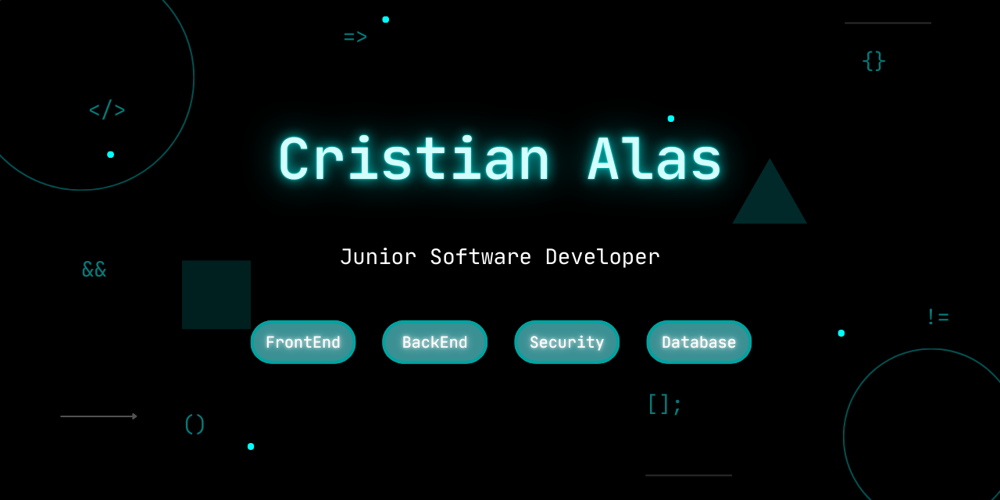

  

# 💫 About Me

### ¡Hello and welcome to my profile! 👋

I'm a 25-year-old full stack developer from El Salvador, with a great passion for technology and software development. I love constantly learning, taking on new challenges, and working on projects that allow me to grow and contribute innovative solutions.

I'm always open to new ideas and collaborations, so feel free to explore my repositories or contact me if you're interested in working together.

Thanks for visiting my profile! 🚀

---

# 💻 Tech Stack

### 🧠 Languages, Frameworks, and Tools I Use:

 

---

# 🌐 My Links

---

# 🎥 Demo / Video

Inventory Management System: User Management, Purchase Management, Receiving and Sales. Implemented with Spring Security and JWT.

---

# 📊 GitHub Stats

 
 

---

### 🔝 Top Contributed Repo

---

<!-- Proudly created with GPRM ( https://gprm.itsvg.in ) -->
